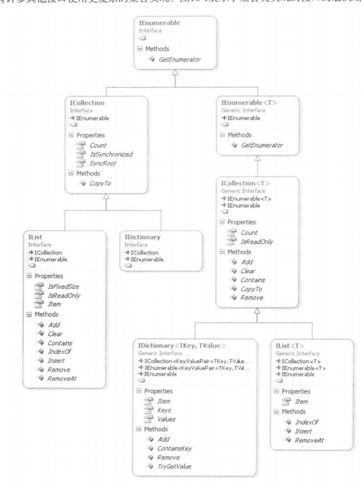

# 索引器、迭代器区别

索引器模式：已知数组长度固定，支持索引操作符([])。

迭代器模式(iterator)：确定第一个元素、下一个元素和最后一个元素，不需要知道元素总数，也不需要按照索引获取元素。

> 例如Stack<T>、Queue<T>、Dictionary<Tkey, Tvalue>等


状态共享

>  集合类不直接支持IEnumerator<T>和IEnumerator接口
>
>  问题：假设多层嵌套循环遍历同一个集合，MoveNext()可能无法正确定位下一个元素
>
>  解决方案：继承自IEnumerable<T>

# LINQ语句

Where()

```c#
//输出一个新的IEnumerable<T>集合
System.Linq.Enumerable.Where();

```


Select()

```c#
//投射
System.Linq.Enumerable.Select();

IEnumerable<string> fileList=Directory.GetFiles(rootDirectory,searchPattern);
IEnumerable<FileInfo> files=fileList.Select(file => new FileInfo(file));
//并行LINQ
var items=fileList.AsParallel().Select(...);

//将集合中的每一项转换成System.IO.FileInfo对象
```


Count()

对元素进行计数


Any()

判断集合中是否有项


OrderBy()和ThenBy()

OrderBy()只有一个，ThenBy()可有多个（附加条件）

# IEnumerable接口相关继承



ICollection<T>中

1. Count属性返回集合中的元素总数
2. CopyTo()方法允许将集合转换成数组

# 主要集合类

## List\<T>


## Dictionary<TKey,TValue>


## SortedList\<T>和SortedDictionary<TKey,TValue>


## Stack\<T>


## Queue\<T>


